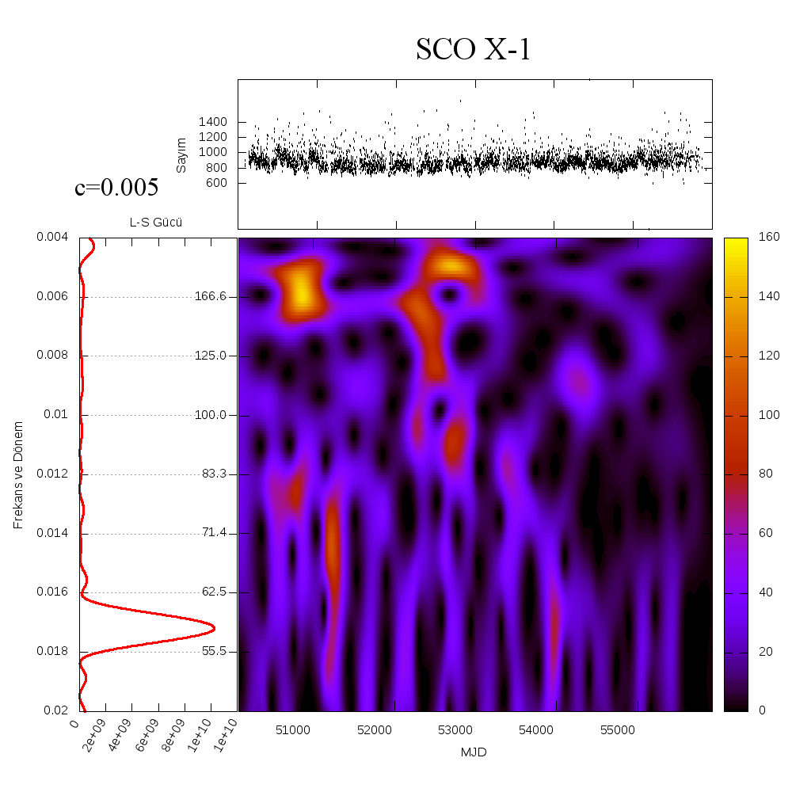

# WWZ Transform Code for Python

This is a Python code for timeseries analysis using WWZ transformations. It uses Foster's abbreviated Morlet Wavelet to analyse timeseries using a WWZ (Weighted Wavelet-Z) transform. (Foster, G., 1996, http://adsabs.harvard.edu/full/1996AJ....112.1709F)

The algoritm is mostly translated from Templeton's Fortran code (Templeton, M., 2004, http://adsabs.harvard.edu/full/2004JAVSO..32...41T).

Details of the mathematics, coding and fundamental time series analysis (especially in astronomy) is available in my thesis (Turkish): http://eayd.in/msc

It can either be used as a module import in another Python script or used as a standalone program. It supports paralellization, yet only in standalone mode.

Dependencies: Python 2.6+ (not Python 3 ready) and NumPy

There is also a Lomb-Scargle script in the repo for ease of use and comparison.

    usage: wwz.py [-h] -f FILE -o OUTPUT -l FREQ_LOW -hi FREQ_HIGH -d FREQ_STEP -c
              DCON [-g] [-m] [-t TIME_DIVISIONS] [--time] [--no-headers]
              [-p PARALLEL]
              
    Input arguments can be read from a file. The file descriptor
        prefix is '@'.
    In order to read argument from a file named args.txt,
        the argument @args.txt should be passed.
    An example for args.txt:

        -f=myinputfile.txt
        -o=theoutputfile.output
        -m
        --freq-step=0.001
        -l=0.001
        -hi=0.01
        -c=0.001
        -p=0

    You can pass arguments from file and commandline at the same time.
    If two same arguments passed by this method, the latter will be
    used. So if you want to override some arguments in a an argument
    file, specify the file first.
    An example usage for our earlier @args.txt is as:

        python wwz.py @args.txt -c=0.0125

    The above command will use the settings in args.txt but will
    use c=0.0125 instead of c=0.001

    Comments and blank lines are NOT allowed in argument files.

    Import this script via Python to use it as a module, rather than
    a standalone script. (import wwz)

    optional arguments:
      -h, --help            show this help message and exit
      -f FILE, --file FILE  the Input File, Raw Lightcurve
      -o OUTPUT, --output OUTPUT
                            the Output File Name
      -l FREQ_LOW, --freq-low FREQ_LOW
                            the Low Frequency Value
      -hi FREQ_HIGH, --freq-high FREQ_HIGH
                            the High Frequency Value
      -d FREQ_STEP, --freq-step FREQ_STEP
                            the dF value, incremental step for Frequency
      -c DCON, --dcon DCON  the C constant for the Window Function
      -g, --gnuplot-compatible
                            the Output file is GNUPlot compatible, which means the
                            tau's will be grouped so that pm3d can easily map.
                            Default value is 'False'.
      -m, --max-periods     Creates a secondary output with the maximum Periods
                            for each single tau. This can be drawn in 2D. The
                            output filename is derived from the -o option, added
                            'max_periods'. Default value is 'False'.
      -t TIME_DIVISIONS, --time-divisions TIME_DIVISIONS
                            The Time Divisions value. Templeton assumes this as
                            50. VStars from AAVSO leaves this optional contrary to
                            Templeton, yet it's default value is also 50.
      --time                Calculate the time of operation in seconds and print
                            to standard output.
      --no-headers          Doesn't print headers to output files if set. Default
                            is 'False'.
      -p PARALLEL, --parallel PARALLEL
                            Created threads to speed up the process. Default value
                            is '1', which means single thread. '0' means number of
                            detected CPUs, can be overridden.

Below is an example of the X-Ray source (observed by the [RXTE](https://heasarc.gsfc.nasa.gov/docs/xte/xte_1st.html) Satellite) with data, Lomb-Scargle and WWZ output.

The example below shows the main advantage of WWZ over LS. There is periodicity that LS failed to detect, with a period of about 166 days. Also note the change in frequency.

